# 🎬 Movie Review Platform Backend

This is a movie review platform backend where users can perform various operations such as registering, logging in, managing movies, and submitting reviews.  
The backend is built with **Node.js** and **Express**, using **bcrypt** for secure password hashing, **JWT** for authentication and role-based authorization, and follows an **MVC architecture** with middleware for handling requests.

---

## 🚀 Features

- User registration and login with role-based access control (`user` and `admin`)
- Movie management (CRUD operations)
- Review management (CRUD operations)
- Fetch movies with average ratings to see movie scores at a glance

---

## 🧩 Mongoose Models

### 🎞️ Movie

- `title`
- `director`
- `releaseYear`
- `genre`

### ✍️ Review

- `movieId` (reference to Movie)
- `userId` (reference to User)
- `rating`
- `comment`
- `createdAt`

### 👤 User

- `username`
- `email`
- `password` (hashed with bcrypt)
- `role` (`user` or `admin`)

---

## 📬 API Endpoints

### 🎥 Movies

- `POST /movies` — Add a new movie
- `GET /movies` — Get all movies
- `GET /movies/:id` — Get movie details
- `PUT /movies/:id` — Update a movie
- `DELETE /movies/:id` — Delete a movie
- `GET /movies/:id/reviews` — Get all reviews for a movie
- `GET /movies/ratings` — Get all movies with their average ratings

### 📝 Reviews

- `POST /reviews` — Add a new review
- `GET /reviews` — Get all reviews
- `GET /reviews/:id` — Get review details
- `PUT /reviews/:id` — Update a review
- `DELETE /reviews/:id` — Delete a review

### 👥 Users

- `POST /register` — Register a new user
- `POST /login` — Log in a user

---

## ⚙️ How to Start the Project

1. Clone the repository  
   `git clone <repo-url>`

2. Install dependencies  
   `npm install`

3. Create a database in **MongoDB**

4. Add your credentials in a `.env` file  
   (use `.env.example` as reference)

5. Start the server  
   `node server.js`  
   The server runs on: [http://localhost:4000](http://localhost:4000)

---

## 📮 API Documentation (Postman)

### 🎥 Movies

#### `POST /movies`

#### `GET /movies`

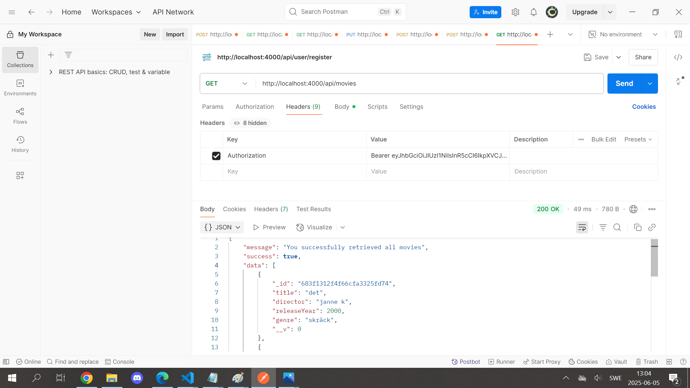

#### `GET /movies/:id`

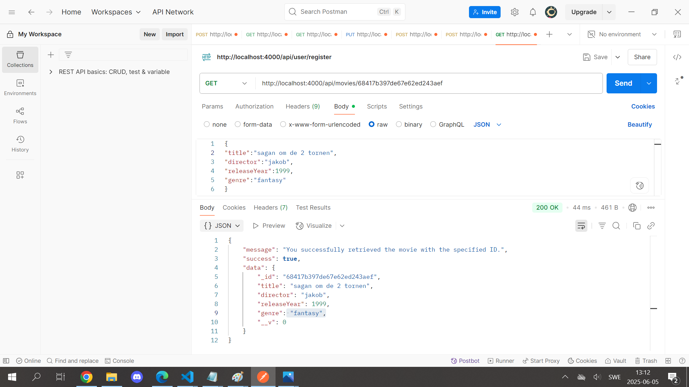

#### `PUT /movies/:id`

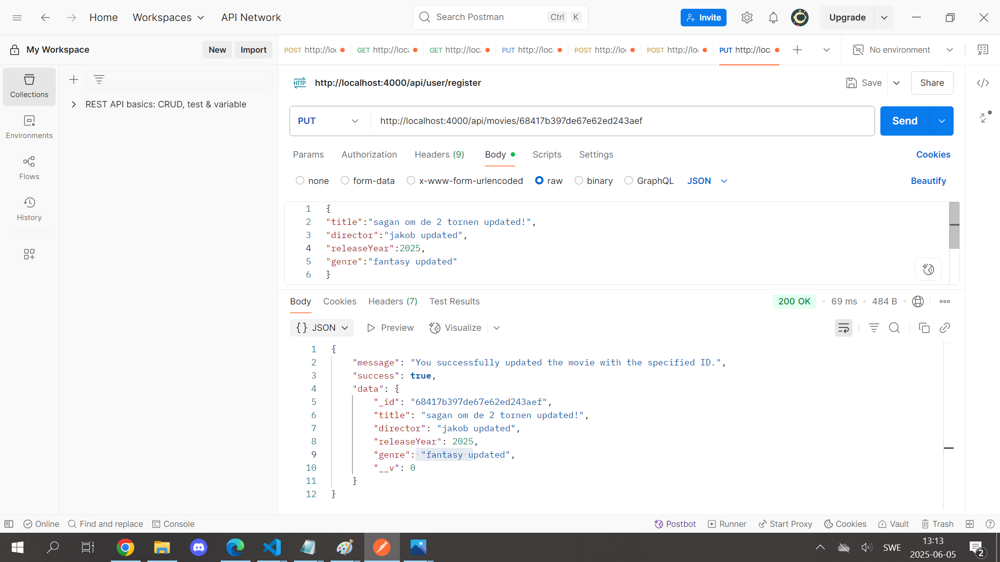

#### `DELETE /movies/:id`

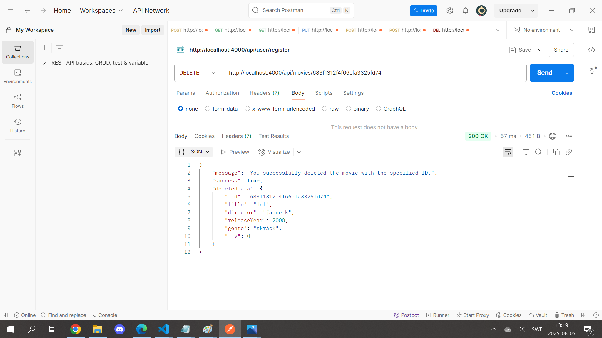

#### `GET /movies/:id/reviews`

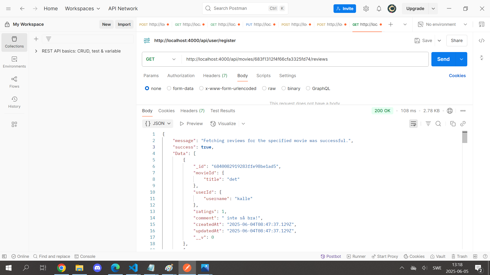

#### `GET /movies/ratings`

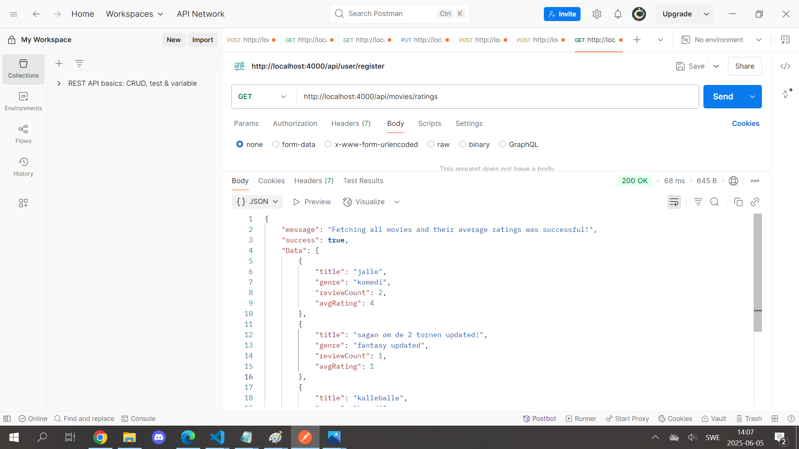

---

### ✍️ Reviews

#### `POST /reviews`

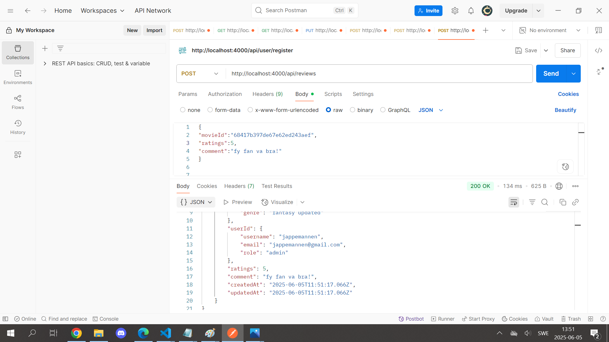

#### `GET /reviews`

#### `GET /reviews/:id`

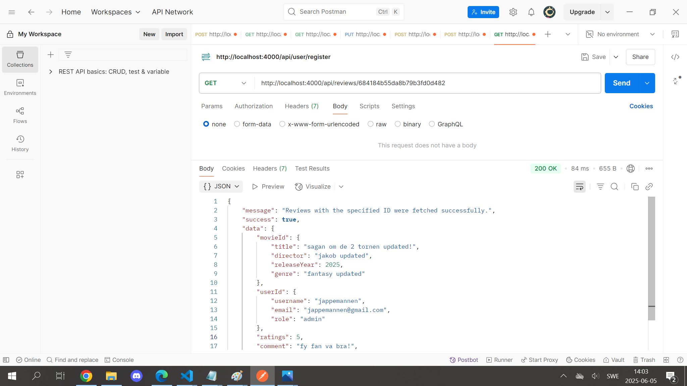

#### `PUT /reviews/:id`

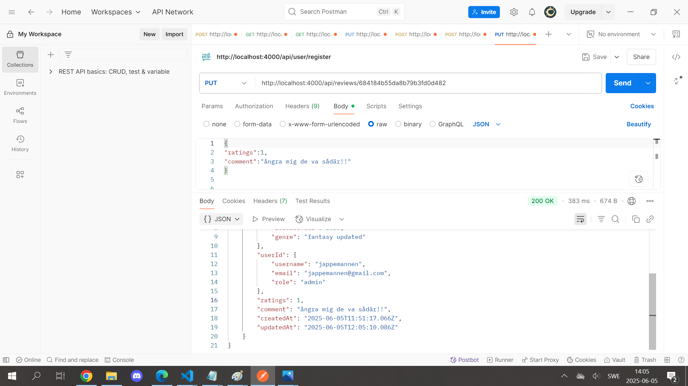

#### `DELETE /reviews/:id`

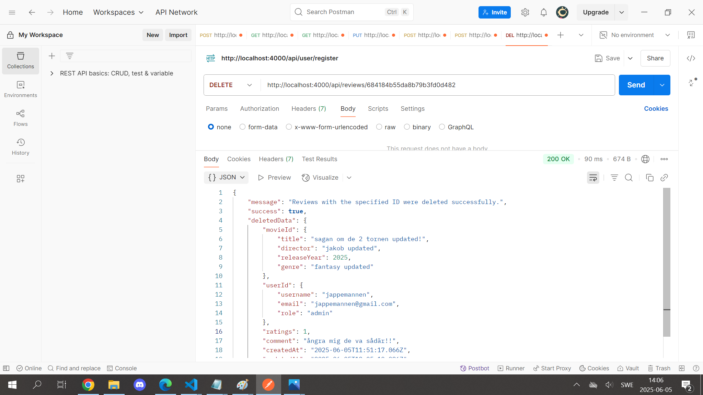

---

### 👤 Users

#### `POST /register`

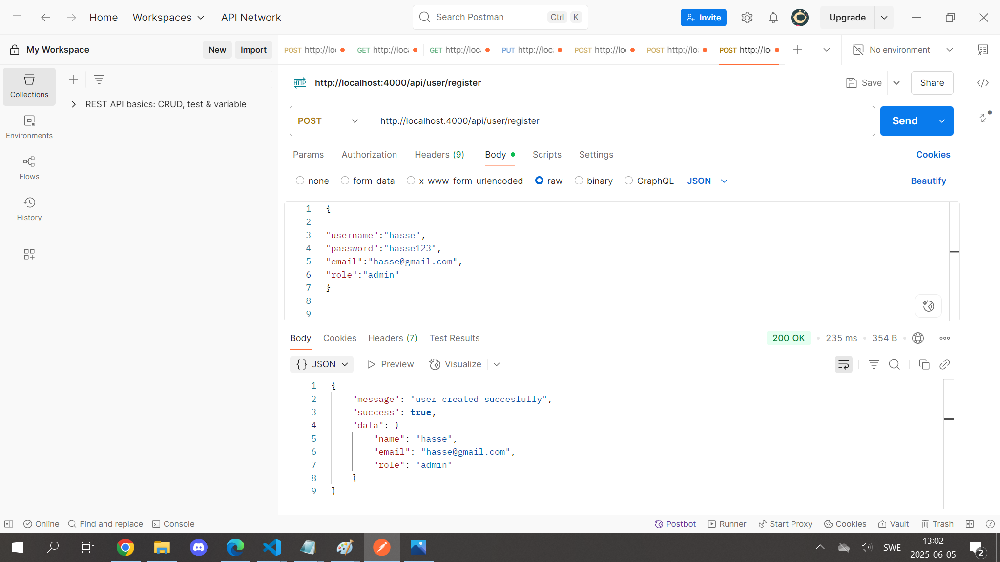

#### `POST /login`

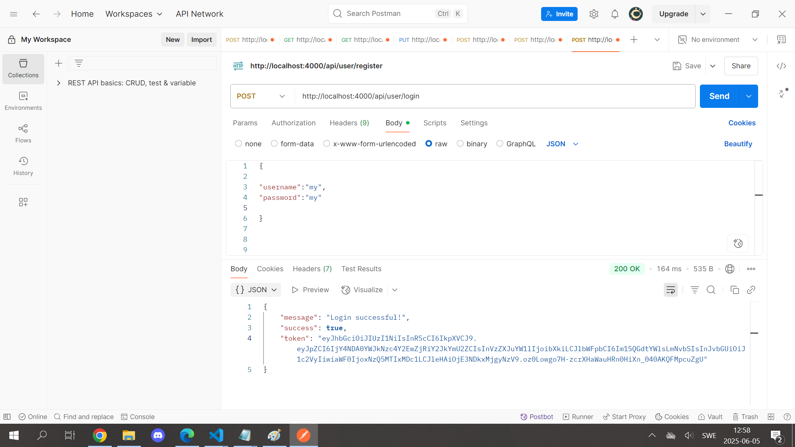

---

## 🧾 MongoDB Collections

### 👥 Users

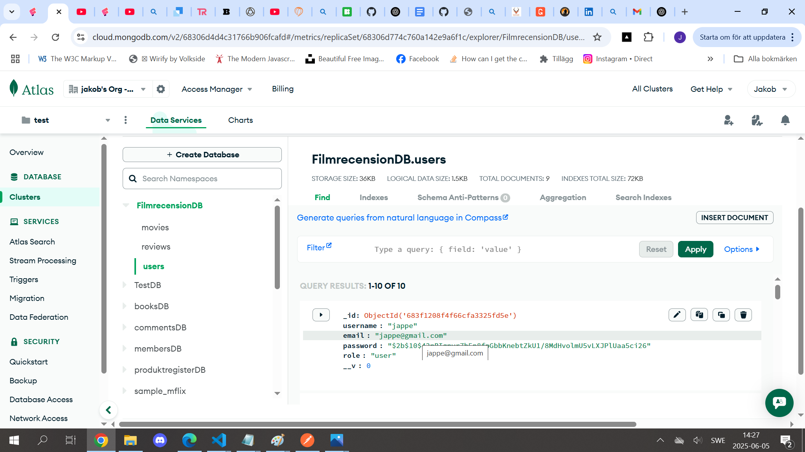

### 🎬 Movies

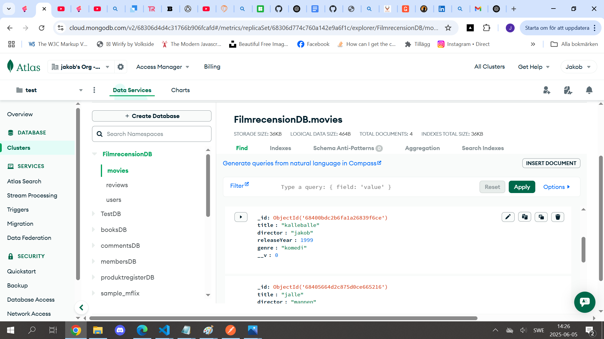

### ✍️ Reviews

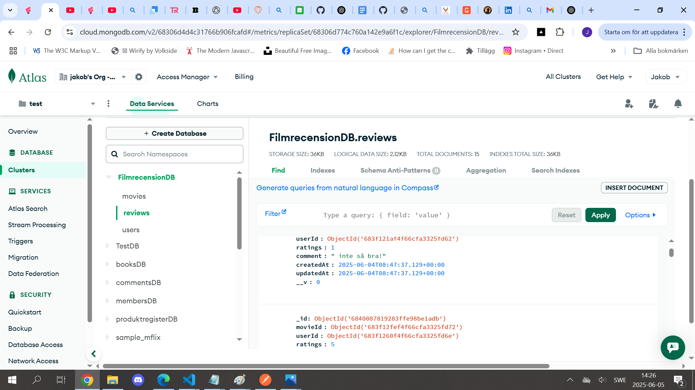

---
