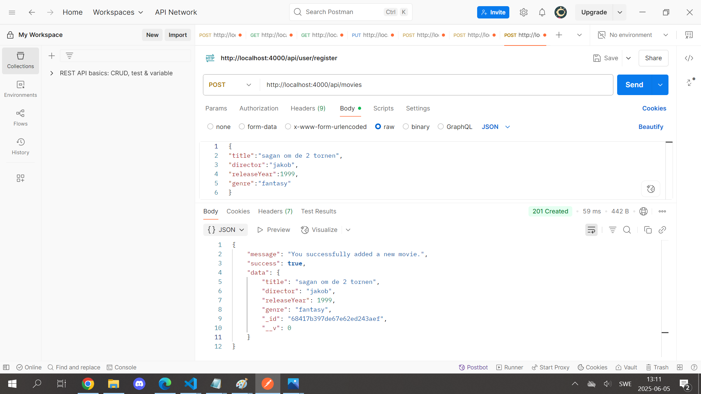

Movie Review Platform Backend
This is a movie review platform backend where users can perform various operations such as registering, logging in, managing movies, and submitting reviews. The backend is built with Node.js and Express, using bcrypt for secure password hashing, JWT for authentication and role-based authorization, and follows an MVC architecture with middleware for handling requests.

Features
User registration and login with role-based access control (user and admin).

Movie management (CRUD operations) — create, read, update, or delete movies.

Review management — create, read, update, and delete reviews.

Fetch movies with average ratings to see movie scores at a glance.

Mongoose Models
Movie:

title

director

releaseYear

genre

Review:

movieId (reference to Movie)

userId (reference to User)

rating

comment

createdAt

User:

username

email

password (hashed with bcrypt)

role (user or admin)

API Endpoints:

POST /movies — Add a new movie
GET /movies — Get all movies
GET /movies/:id — Get movie details
PUT /movies/:id — Update a movie
DELETE /movies/:id — Delete a movie
GET /movies/:id/reviews — Get all reviews for a movie
POST /reviews — Add a new review
GET /reviews — Get all reviews
GET /reviews/:id — Get review details
PUT /reviews/:id — Update a review
DELETE /reviews/:id — Delete a review
POST /register — Register a new user
POST /login — Log in a user
GET /movies/ratings — Get all movies with their average ratings

1.How to Start the Project

1.Clone the repository
2.Install dependencies, npm install
3.Create a database in MongoDB.
4.Add your credentials in an .env file (.env.example for reference)
5.Start the server:node server.js, tthe server is running on: (http://localhost:4000)

2.Documentation POSTMAN

POST /movies

GET /movies

GET /movies/:id
PUT /movies/:id
DELETE /movies/:id
GET /movies/:id/reviews
POST /reviews
GET /reviews
GET /reviews/:id
PUT /reviews/:id
DELETE /reviews/:id
POST /register
POST /login
GET /movies/ratings

3.Documentation MONGODB
